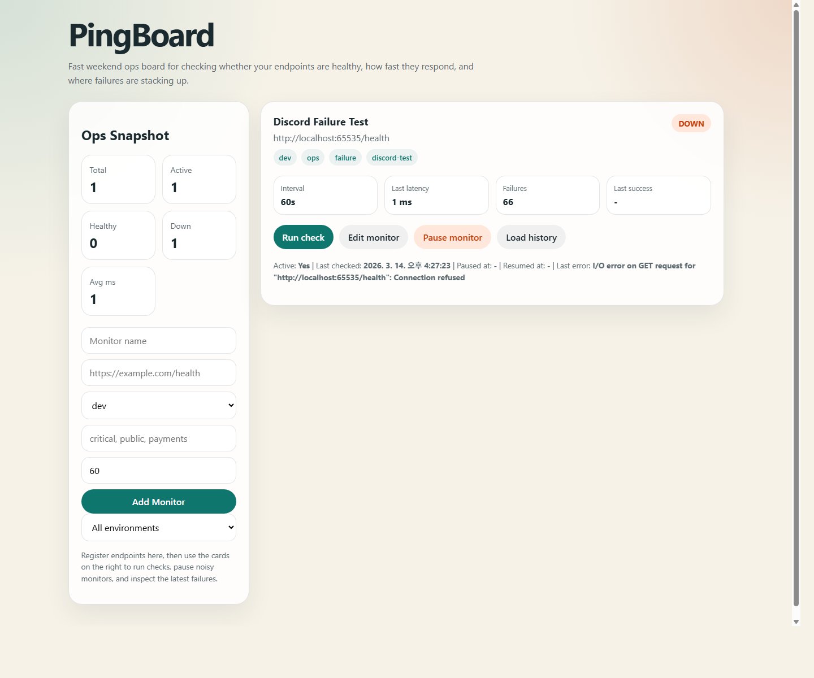
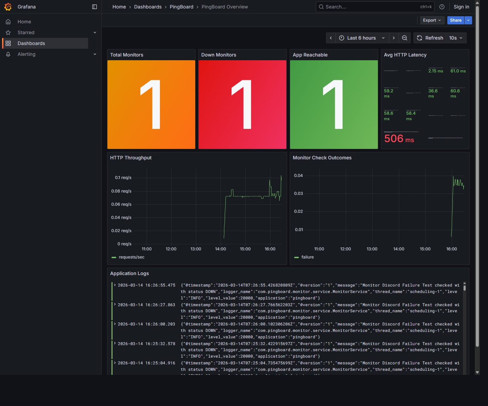

# PingBoard

PingBoard는 Spring Boot 기반으로 만든 엔드포인트 상태 점검 서비스입니다.

단순히 API를 만드는 데서 끝나지 않고, 배포 이후 실제로 서비스가 어떻게 운영되는지까지 경험해 보기 위해 만든 프로젝트입니다. URL 상태 점검, 장애 이력 저장, Discord 알림, Sentry 예외 추적, Grafana/Loki 기반 관측, Render 배포, GitHub Actions 자동 배포까지 하나의 흐름으로 검증할 수 있게 구성했습니다.

## 어떤 문제를 해결하나

작은 서비스라도 장애가 나면 보통 여러 도구를 왔다 갔다 하게 됩니다.  
"지금 서비스가 진짜 죽었는지", "로그에 뭐가 남았는지", "알림이 제대로 갔는지", "예외는 어디서 확인해야 하는지"를 빠르게 판단하기 어렵습니다.

PingBoard는 이 과정을 한 곳으로 모으는 데 초점을 맞췄습니다.  
모니터를 등록하고, 실패를 감지하고, Discord로 알림을 보내고, Sentry에서 예외를 확인하고, Grafana에서 메트릭과 로그를 함께 보는 흐름을 직접 만들고 검증할 수 있습니다.

## 스크린샷





## 주요 기능

- HTTP/HTTPS 모니터 등록
- 현재 상태 및 최근 이력 조회
- 환경(`prod`, `staging`, `dev`)과 태그 기반 분류
- 수동 체크 실행
- 기존 모니터를 삭제하지 않고 수정 가능
- 모니터 일시정지 / 재개
- 재개 직후 즉시 상태 점검
- PostgreSQL/H2 기반 이력 저장
- 30초 주기의 스케줄 체크
- 간단한 웹 대시보드 제공
- `/actuator/health`, `/actuator/metrics`, `/actuator/prometheus` 노출
- Discord 기반 장애 / 복구 알림
- Sentry 기반 예외 추적
- 운영자 인증 보호

## 기술 스택

- Java 21
- Spring Boot 3.5
- Spring Web / Validation / Data JPA / Actuator / Security
- PostgreSQL
- H2
- Prometheus
- Grafana
- Loki / Promtail
- Sentry
- Docker / Docker Compose
- Render
- GitHub Actions

## 로컬 실행

### 1. H2 메모리 DB로 빠르게 실행

```bash
./gradlew bootRun
```

### 2. PostgreSQL로 실행

```bash
docker compose up -d postgres
set SPRING_PROFILES_ACTIVE=postgres
./gradlew bootRun
```

### 3. 앱 + Postgres + Prometheus + Grafana + Loki 전체 스택 실행

```bash
docker compose up --build
```

### 4. Discord 알림 활성화

```bash
set PINGBOARD_ALERTS_ENABLED=true
set PINGBOARD_ALERTS_PROVIDER=DISCORD
set PINGBOARD_ALERTS_WEBHOOK_URL=https://discord.com/api/webhooks/...
set PINGBOARD_ALERTS_FAILURE_THRESHOLD=3
./gradlew bootRun
```

### 5. 운영자 계정

기본적으로 `/`, `/api/**`는 HTTP Basic 인증으로 보호됩니다.

기본 계정:

```text
username: operator
password: pingboard123!
```

원하면 환경변수로 바꿀 수 있습니다.

```bash
set PINGBOARD_OPERATOR_USERNAME=ops-admin
set PINGBOARD_OPERATOR_PASSWORD=change-me
./gradlew bootRun
```

### 6. 환경값 템플릿

`.env.example`을 `.env`로 복사한 뒤 필요한 값만 채우면 됩니다.  
Sentry나 webhook 값을 비워도 로컬 기본 실행은 가능합니다.

## 배포

PingBoard는 Render 배포를 기준으로 준비되어 있습니다.

- Blueprint: [render.yaml](/C:/Users/ParkJaeHong/PingBoard/render.yaml)
- 테스트 워크플로우: [.github/workflows/ci.yml](/C:/Users/ParkJaeHong/PingBoard/.github/workflows/ci.yml)
- Render 배포 훅 워크플로우: [.github/workflows/render-deploy.yml](/C:/Users/ParkJaeHong/PingBoard/.github/workflows/render-deploy.yml)
- 배포 체크리스트: [deployment-checklist.md](/C:/Users/ParkJaeHong/PingBoard/docs/operations/deployment-checklist.md)

관련 운영 문서:

- [runbook.md](/C:/Users/ParkJaeHong/PingBoard/docs/operations/runbook.md)
- [backup-recovery.md](/C:/Users/ParkJaeHong/PingBoard/docs/operations/backup-recovery.md)
- [data-retention.md](/C:/Users/ParkJaeHong/PingBoard/docs/operations/data-retention.md)

## 주요 API 예시

### 모니터 생성

```bash
curl -X POST http://localhost:8080/api/monitors ^
  -H "Content-Type: application/json" ^
  -d "{\"name\":\"OpenAI\",\"url\":\"https://example.com\",\"intervalSeconds\":60,\"environment\":\"prod\",\"tags\":[\"critical\",\"public\"]}"
```

### 모니터 목록 조회

```bash
curl http://localhost:8080/api/monitors
curl http://localhost:8080/api/monitors?environment=prod
```

### 수동 체크 실행

```bash
curl -X POST http://localhost:8080/api/monitors/1/checks
```

### 일시정지 / 재개

```bash
curl -X POST http://localhost:8080/api/monitors/1/pause
curl -X POST http://localhost:8080/api/monitors/1/resume
```

### 최근 이력 조회

```bash
curl http://localhost:8080/api/monitors/1/checks
```

### 요약 정보 조회

```bash
curl http://localhost:8080/api/monitors/summary
curl http://localhost:8080/api/monitors/summary?environment=staging
```

## 관측 포인트

- Health: `http://localhost:8080/actuator/health`
- Prometheus Metrics: `http://localhost:8080/actuator/prometheus`
- Prometheus UI: `http://localhost:9090`
- Grafana UI: `http://localhost:3000`
- Loki API: `http://localhost:3100`
- PingBoard 대시보드: `http://localhost:8080`

`/actuator/health`와 `/actuator/info`는 프로브용으로 공개합니다.  
`/actuator/prometheus`는 로컬 Prometheus가 바로 수집할 수 있도록 공개해 두었습니다.

Grafana는 Prometheus와 Loki 데이터소스, 그리고 `PingBoard Overview` 대시보드를 기본으로 프로비저닝합니다.

## Sentry 확인

Sentry DSN을 넣은 뒤, 아래 엔드포인트로 테스트 예외를 발생시킬 수 있습니다.

```bash
curl -X POST -u ops-admin:change-me http://localhost:8080/api/dev/sentry-test
```

## 앞으로 더 해볼 수 있는 것

- 오래된 check history 자동 정리
- 운영 환경에서 `/api/dev/sentry-test` 추가 보호
- 알림 노이즈 줄이기
- 메트릭 패널 확장
- 커스텀 도메인 + TLS 운영 정리
